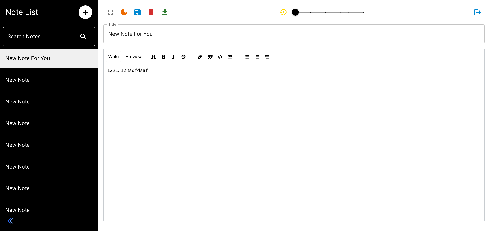

# Web-Simple-Notes

Web Simple Notes is a sleek, user-friendly web application designed to streamline your note-taking experience. Built with React.js for the frontend and Spring Boot for the backend, this app offers a responsive and intuitive interface for managing your notes efficiently and securely.

### Based
- [React.js](https://reactjs.org/)
- [Spring Boot](https://spring.io/projects/spring-boot)
- [MySQL](https://www.mysql.com/)
- [MUI](https://mui.com/)

### Features
- **Responsive Design**: The app adapts seamlessly to various devices, ensuring a smooth user experience.
- **Secure Authentication**: Built-in user authentication with email and password, ensuring your notes are protected.
- **Note Management**: Create, edit, and delete notes with ease, all within a clean and organized interface.
- **Data Persistence**: Your notes are stored securely on the server, ensuring they are backed up and accessible from anywhere.

### Screenshots


### Getting Started
1. Clone the repository:
   ```bash
   git clone https://github.com/zhangboheng/Web-Simple-Notes.git
   ```
2. Navigate to the project directory:
   ```bash
   cd Web-Simple-Notes
   ```
3. Navigate to the spring-boot directory and run the following command to install the required dependencies:
   ```bash
   mvn install
   ```
4. Set up the database:
   - Create a MySQL database and import the provided SQL script(at sql/moneyspeed.sql)
   - Update the spring-boot directory's `application.properties`, `application-dev.properties` and `application-prod.properties` files with your database credentials.
5. Start the Spring Boot application:
   ```bash
   mvn spring-boot:run
   ```
6. Then, navigate to the react-ui directory and run the following command to start the React application:
   ```bash
   npm install
   npm run start
   ```
7. Open your web browser and navigate to `http://localhost:3000` to access the Web Simple Notes application.

8. Register or login to access the application.

### Contributing
Contributions are welcome! Feel free to submit issues, pull requests, or suggest new features.


